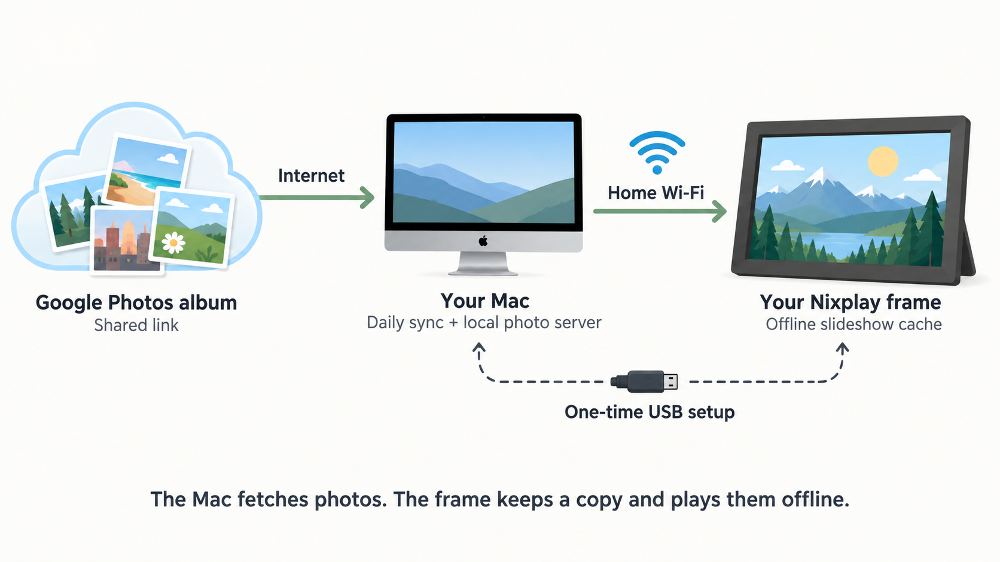

# Nix Free Frame

This Nixplay frame used to depend on Nixplay’s cloud. Now it shows a Google Photos album through a Mac on the same Wi-Fi, with its own local slideshow app. Your Mac refreshes the album daily; the frame keeps a copy so photos continue cycling when the Mac is unavailable. No firmware replacement was needed.

This was tested on a [**Nixplay 10.1-inch Smart Digital Photo Frame (W10F)**](https://www.amazon.com/dp/B07V42JLFH), with our tested unit identifying as **W10F-09**, running Android 7.1.2 and rendering at 1280 × 800. Other models and hardware revisions may differ: your mileage may vary. Setup supports an Apple Silicon Mac.

## Getting started

1. **Connect the frame to your Mac.** Use a data-capable micro-USB cable. On this frame the port is internal, so read [the USB guide](docs/usb-setup.md) first. Unplug power before opening and stop if your assembly differs.
2. **Choose an album and a host Mac.** Enable link sharing for the Google Photos album, keep that link private, and keep your Mac awake and connected to the frame’s Wi-Fi for daily refreshes. Anyone with the sharing link can view the album.
3. **Give your coding agent this repository.** Tell it to read [the setup runbook](docs/agent-setup.md) and guide you through installation. It can prepare the software and checks; you handle the cable, device prompts and screen confirmation.

Setup adds Android build tools, a private photo cache and background sync/server jobs to your Mac, plus the slideshow app to the frame. Original frame apps and recovery backups are retained. Photos crossfade, show dates when known, and dim overnight.
