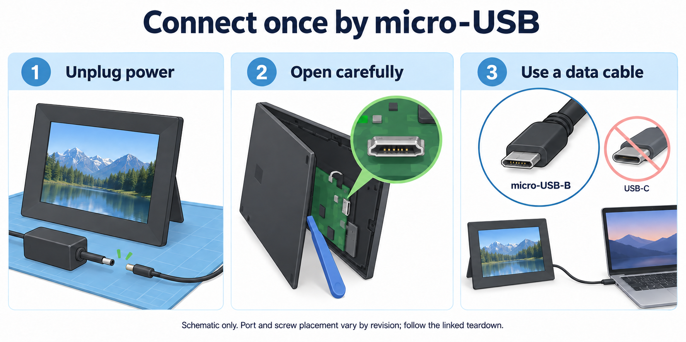

# Connecting the frame by USB

*This illustration explains the connection sequence; it is not a photograph or a verified board-layout diagram.*

Use a **data-capable micro-USB cable**. First installation needs physical USB access; your agent can help find the frame’s address on your home Wi-Fi, but Wi-Fi discovery does not replace the first USB installation.

Unplug power before opening. Use a plastic opening tool, work on a soft surface and protect ribbon cables. [A firsthand W10F owner](https://www.reddit.com/r/selfhosted/comments/1l3bz5a/comment/ojali9n/) describes releasing the bezel, six silver chassis screws and two black board screws to reach micro-USB underneath. That owner's revision is unspecified; our W10F-09 screw layout was not independently recorded. Stop if yours differs.

Connect to the Mac, handle any USB authorization prompt, then let the agent check the device before installation. Keep original apps and recovery backups. See [the detailed access notes](how-we-did-it.md#accessing-the-internal-usb) and [agent setup](agent-setup.md).

For photographic context, see [E.Z. Hart’s W13D teardown](https://ezhart.com/posts/digital-frame-hacking-1), including its [micro-USB port photograph](https://ezhart.com/images/frame/usb-port.jpg). **That is a different model, not a W10F-09 layout guide.** The photographs remain on their original copyrighted site; this repository does not copy or relicense them.
